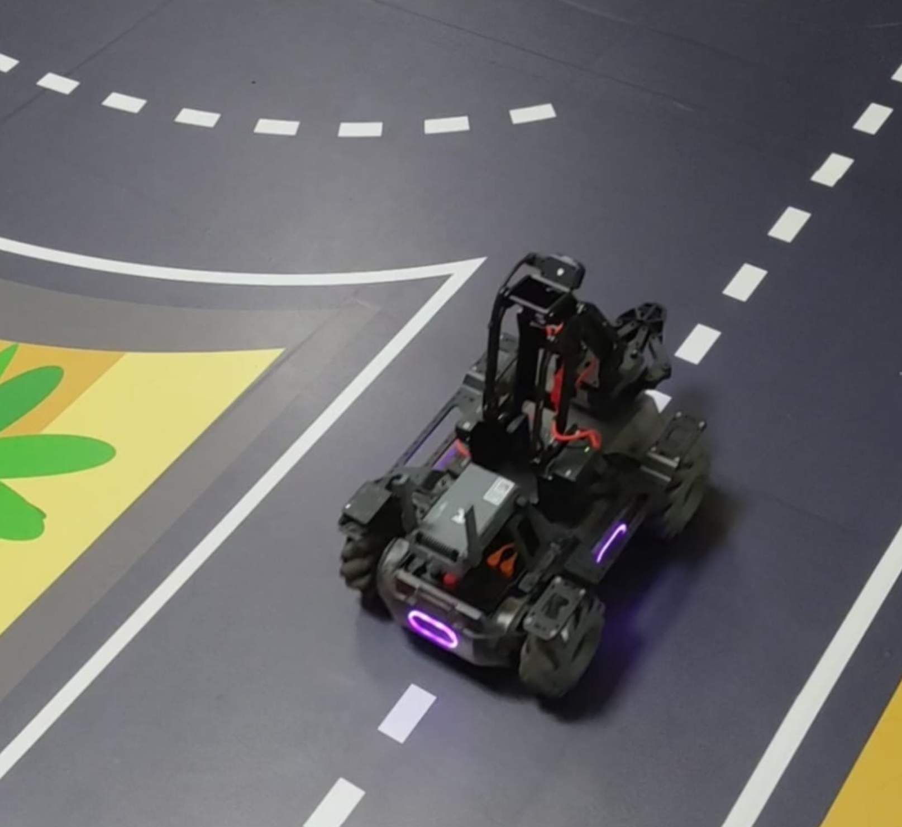
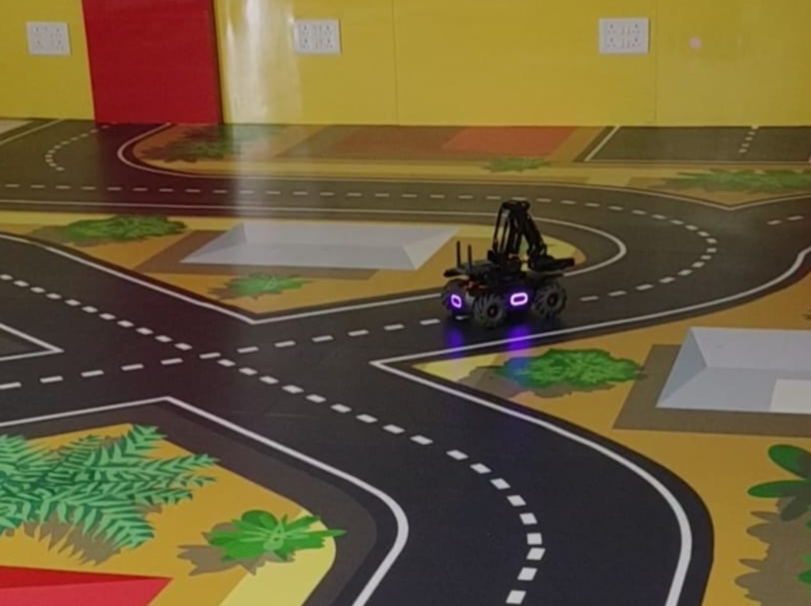
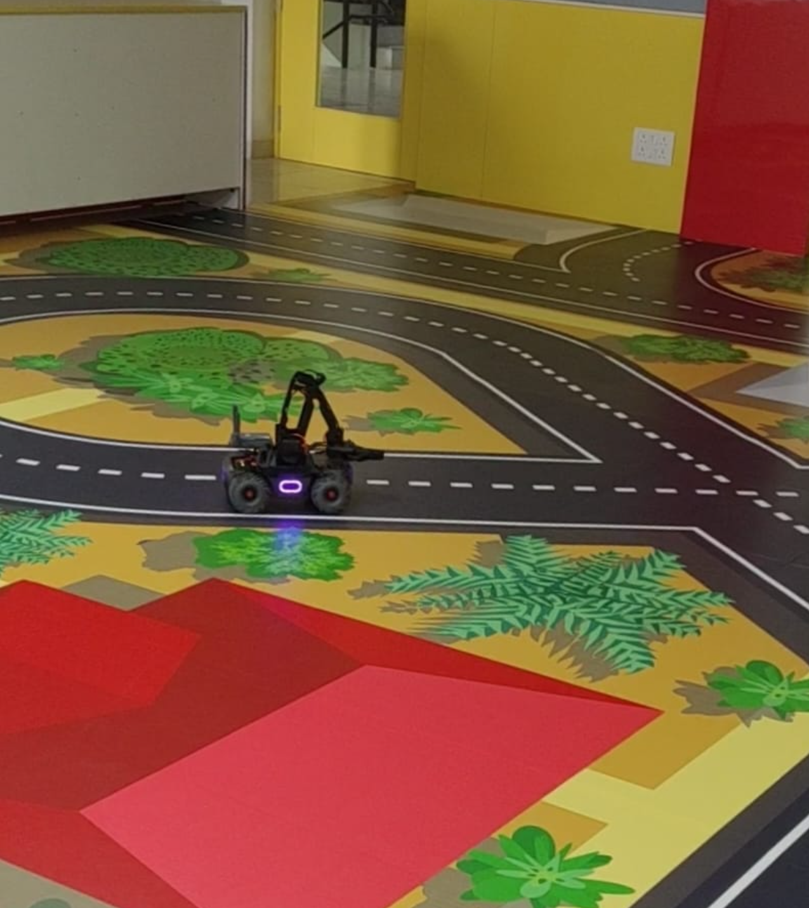

# MobileRobot-Openloopcontrol
## AIM:

To develop a python control code to move the mobilerobot along the predefined path.

## EQUIPMENT'S REQUIRED::
1. RoboMaster EP core
2. Python 3.7

## PROCEDURE:
### Step 1:
Initiate the MobileRobot.

### Step 2:
Connect your PC with the MobileRobot.

### Step 3:
Open Python program.

### Step 4:
Program the movements of the robot using python code.

### Step 5:
Execute the python program.

## PROGRAM:
```
Python control code to move the mobilerobot along the predefined path.
Developed by: Aashima Nazreen Sayeed S
Register No.: 21500368
from robomaster import robot
import time

if _name_ == '_main_':
    ep_robot = robot.Robot()
    ep_robot.initialize(conn_type="ap")

    ep_chassis = ep_robot.chassis

    ep_chassis.move(x=2.7, y=0, z=0, xy_speed=0.75).wait_for_completed()

    ep_chassis.move(x=0, y=0, z=45, xy_speed=1).wait_for_completed()

    ep_chassis.move(x=3, y=0, z=0, xy_speed=0.75).wait_for_completed()
    ep_chassis.move(x=0, y=-0.2, z=0, xy_speed=0.75).wait_for_completed()
    
    ep_chassis.drive_speed(x=0.3,y=0,z=-17)
    time.sleep(15)

    ep_chassis.move(x=0, y=0.5, z=0, xy_speed=0.75).wait_for_completed()
 
    ep_chassis.move(x=2, y=0, z=0, xy_speed=0.75).wait_for_completed()

    ep_robot.close()
```

## MobileRobot Movement Image:


### Start Point:


### End Point:


### Mobilerobot Movement Image:


## RESULT:
Thus the python program code is developed to move the mobilerobot in the predefined path.

```
Mobile Robotics Laboratory
Department of Artificial Intelligence and Data Science/ Machine Learning
Saveetha Engineering College
```
